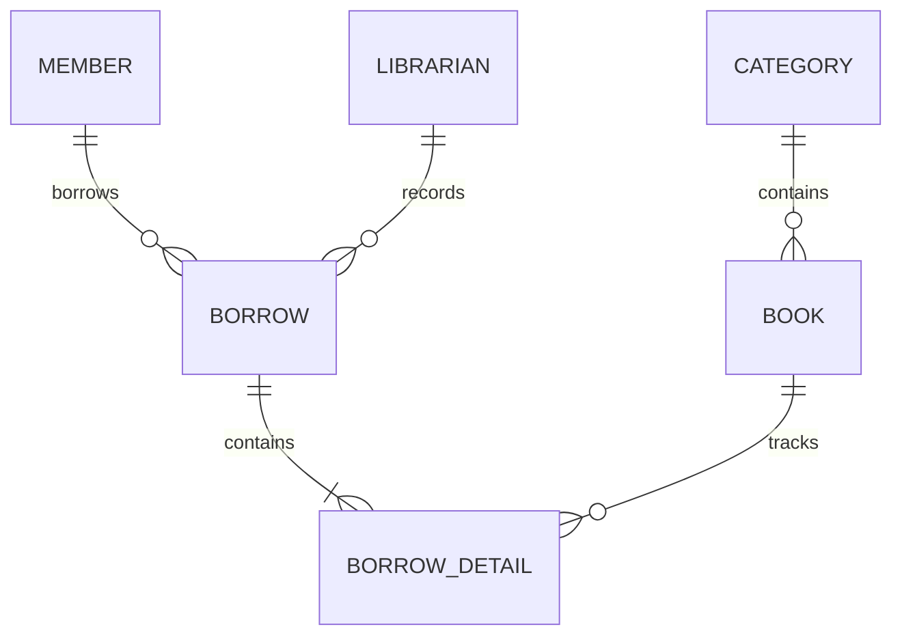

# Library Management System

Windows Forms application using .NET 10 and PostgreSQL. All screens use the same database: categories, books, members, borrowing, returns, history, dashboard totals, and librarian login.

## Run

Requires the .NET 10 SDK and PostgreSQL. The default connection is localhost:5432, database `library_management`, user `postgres`, password `1234`. Override it with the `LIBRARY_DB_CONNECTION` environment variable when needed:

```powershell
$env:LIBRARY_DB_CONNECTION = 'Host=localhost;Port=5432;Database=library_management;Username=postgres;Password=your-password'
dotnet run --project Library-System/library_system.csproj
```

Close a running copy before rebuilding its output directory. To build separately while it is running:

```powershell
dotnet build Library-System.slnx --artifacts-path .artifacts
```

## Database setup

The local database was initialized during development. For a new installation:

```powershell
$env:PGPASSWORD = 'your-postgres-password'
./database/setup.ps1 -AdminUsername admin -AdminPassword 'your-admin-password'
```

Use `-PsqlPath` if PostgreSQL is installed elsewhere. The script creates a missing database, creates the tables and indexes from `database/schema.sql`, and adds the administrator only if the username does not exist. It preserves existing rows and passwords; it does not migrate incompatible existing table definitions.

The local initial login is **admin / 1234**. Login verifies a salted PBKDF2 password hash stored in `Librarian`; credentials are not checked against constants in the login form. Library records start empty.

## Workflow and relationships

1. Create categories, then add books and select their saved category.
2. Register members. Only active members can borrow.
3. Select a member and available books in Borrow Books. Confirmation saves one transaction with a detail for each book and displays its Borrow ID.
4. Enter that Borrow ID in Return Books, select a book, and return it. Partial returns leave the other books on loan.
5. History joins the member, book, and librarian records. Search supports text, status, and the inclusive borrow-date range. Clear resets the date range to the last month.



Borrowing and returns update inventory in database transactions. Editing total stock preserves the number of copies on loan. Referenced categories and books cannot be deleted, keeping history intact. Deactivated members can still return existing loans. A borrowing transaction becomes Returned when all its details are returned.

Fines are $1 per overdue day per book, calculated from date values by `LoanRules`. Outstanding history shows the fine as of today; returned history shows the saved final fine. Dashboard counts refresh on opening, clicking Dashboard, and closing a module. Module lists reload on opening, searching, clearing, and after successful changes.

## Verification

```powershell
dotnet run --project tests/LibrarySystem.IntegrationTests.csproj --artifacts-path .artifacts
```

The test runner uses the configured PostgreSQL server and requires permission to create a database. It creates a uniquely named `library_system_test_*` database and removes only that database afterward. It tests persistent CRUD, form data loading, login, relationship constraints, filters, stock consistency, rollback, partial returns, fines, and concurrent borrow/return requests without modifying library records.
